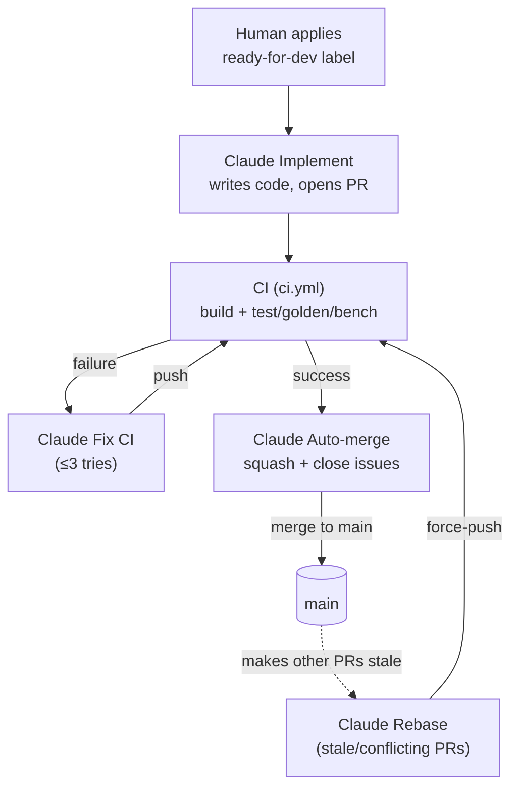

# GitHub Workflows

Automation for yamabuki. The design of the **Claude Build Loop** is ported from
the omega-ios workflows, adapted so that yamabuki's own CI (`ci.yml`) is the
verification gate the whole loop keys off.

The pieces:

1. **Build gate** — `ci.yml` (name: `CI`) compiles and runs every check
   (`zig build test` on Debug + ReleaseFast, `zig build fuzz`, SST vectors,
   goldens/rom-runner, SDL smoke, static-link and shader assertions). Its
   pass/fail is the signal the loop reacts to. **Unchanged by this port.**
2. **The Claude Build Loop** — an autonomous pipeline that takes a
   `ready-for-dev` issue to a merged PR: implement → (CI) → fix CI → rebase when
   stale → auto-merge. Each stage is its own workflow so the pieces compose and
   fail independently.
3. **Backlog hygiene** — `claude-groom.yml` grooms open issues daily (dry-run by
   default).

## At a glance

| Workflow | File | Trigger(s) | Role |
| --- | --- | --- | --- |
| **CI** | `ci.yml` | `pull_request`; push to `main` | The quality gate: build + full test/golden/bench suite. The loop keys off its result. |
| **Claude Implement** | `claude-implement.yml` | issue labeled `ready-for-dev`; manual (issue #) | Loop 1/3: implements the issue on `claude/issue-<n>-<slug>` and opens a PR. |
| **Claude Fix CI** | `claude-fix-ci.yml` | `CI` completed → `failure` | Loop 2/3: reads the failing logs and fixes the branch (≤3 attempts). |
| **Claude Rebase** | `claude-rebase.yml` | cron `*/15`; manual | Loop 2b/3: rebases open `claude/issue-*` PRs that `main` made `CONFLICTING`. |
| **Claude Auto-merge** | `claude-automerge.yml` | `CI` completed → `success` | Loop 3/3: squash-merges the green PR and closes its linked issues. |
| **Claude Groom** | `claude-groom.yml` | cron `0 8 * * *`; manual | Daily backlog hygiene (dry-run default). |
| **publish-site** | `publish-site.yml` | (unchanged) | Site/deck publishing. |

## How it fits together

## Why this shape (and what it fixes)

The previous automation was a single `claude-loop.yml` cron that, every 3 hours,
tried to *both* babysit PRs *and* implement an issue inside one prompt — and its
tool allowlist (`gh`/`git`/`Edit`/`Write` only) could not run `zig build` or the
test suite. So it could merge PRs but never verify a new implementation: Step 2
burned its turn budget on denied build commands and stranded branches with no PR
(e.g. `claude/issue-44`, fully implemented, never opened). This port fixes that
two ways:

- **CI is the verifier, not the agent.** The agent writes code and opens a PR;
  `ci.yml` runs the real gate; the loop reacts to its `workflow_run` result. The
  agent is *also* given `zig` locally so it can self-check and reduce Fix-CI
  rounds, but it never has to — verification can't be starved by an allowlist.
- **Event-driven + decomposed.** Implement fires on the label; Fix CI on a red
  build; Auto-merge on a green build; Rebase (cron) covers the one case events
  can't — a green-but-stale PR. Issues can be in flight concurrently instead of
  one every 3 hours, and no stage can silently strand work: Fix CI caps at 3
  attempts then asks for a human, and Rebase drafts a PR it can't resolve.

## Entry point

A human applies the **`ready-for-dev`** label to a specced issue → Implement
fires. Issues that were *already* labeled before this loop went live won't replay
the `labeled` event — kick them with **Run workflow** on Claude Implement (enter
the issue number), or remove and re-add the label.

## Conventions

- **`claude/issue-<n>-<slug>`** branches are the loop's unit of work.
- **`Closes #<n>`** in a PR body links the issue (Auto-merge also closes it
  explicitly, since a token-made merge doesn't always auto-close).
- **`[claude-fix]`** commit prefix counts Fix-CI attempts (cap 3).
- **`allowed_bots: "claude"`** lets Fix CI / Rebase / Auto-merge act on the
  loop's own bot-authored branches.
- **`ready-for-dev`** is the human build-approval label and the only entry point.

## Configuration

- **`CLAUDE_CODE_OAUTH_TOKEN`** — subscription OAuth token for
  `claude-code-action` (all Claude jobs). Generate with `claude setup-token`.
- **`GH_PAT`** (strongly recommended) — a fine-grained PAT with contents +
  pull-requests + issues write. The loop uses it instead of the built-in
  `GITHUB_TOKEN` so the agent's pushes/PR-opens **re-trigger CI** — which is what
  wakes Fix CI and Auto-merge. Without it, `GITHUB_TOKEN`-created events don't
  start new workflow runs and the loop stalls after Implement.

## Intentionally not ported (yet)

The omega-ios set also includes a GitHub **Project board** mirror (`triage-board`),
a **Greenlight** workflow that turns "drag card to In dev" into the `ready-to-dev`
label, and iOS **Release / TestFlight** workflows. Those are skipped here:

- Board + Greenlight need a GitHub Project and a `PROJECT_PAT` (classic PAT with
  `project` + `repo` scopes). Until that infra exists, the plain `ready-for-dev`
  label is the entry point — no board required.
- Release/TestFlight are iOS/Xcode-specific and don't apply to yamabuki.

If you set up a triage Project, the board + Greenlight pair can be ported on top
of this loop unchanged in spirit.
