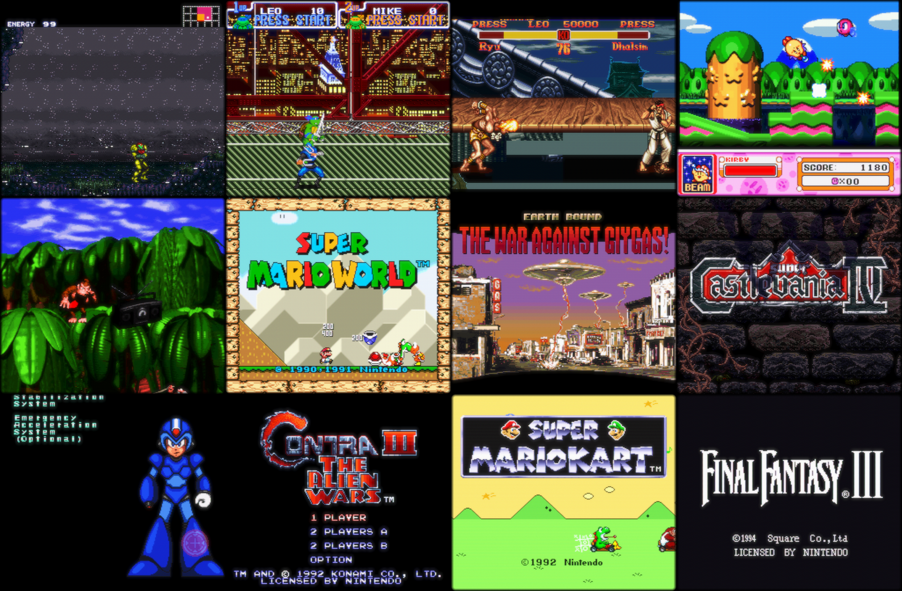

# Yamabuki

A fast, cross-platform SNES emulator written in Zig, built to run full speed
on underpowered ARM handhelds.

## Design goals

- **Speed first**: scanline-based fast core by default, engineered for weak
  ARM chips (Cortex-A53-class and below). Zero heap allocation per frame,
  zero function pointers on hot paths — Zig `comptime` specialization
  generates monomorphized interpreters and renderers.
- **Hybrid accuracy**: an opt-in accurate core (dot-level PPU, per-access
  timing) is built from the same source via `comptime`, selectable at runtime
  per game.
- **Portable**: pure-Zig core with no external dependencies; cross-compiles
  to x86_64 and aarch64 (glibc and musl) with `zig build` alone.
- **Deployable**: libretro core for RetroArch-based handheld firmware, plus
  an SDL3 desktop app for development, and a headless runner for CI.

## Building

Requires Zig 0.16.0 (pinned in `.zigversion`; `tools/install_zig.sh`
installs it from PyPI if ziglang.org is unreachable).

```sh
zig build                        # headless runner + libretro core + SDL3 desktop app
zig build test                   # unit tests
tools/fetch_test_data.sh         # fetch CPU test vectors + test ROMs (gitignored)
zig build test-sst               # run 65816 SingleStepTests vectors
zig build test-sst-spc700        # run SPC700 SingleStepTests vectors
zig build test-roms              # render PeterLemon ROMs, check golden hashes
zig build test-roms -Drom-accurate  # same goldens on the accurate core
zig build test-libretro          # drive the libretro core against the same goldens
zig build fuzz                   # deterministic fuzz: random PPU/bus traffic + save/load roundtrip
zig build bench -- <rom.sfc>     # headless FPS benchmark (JSON)
zig build bench-check            # gate the deterministic perf baseline (steps/cycles/vram_reads)
zig build -Doptimize=ReleaseFast -Dtarget=aarch64-linux-musl  # handheld build
tools/package_handheld.sh        # static musl handheld package (asserts no dynamic deps)
```

CRT shaders are baked ahead of time, once:

```sh
tools/fetch_shaders.sh           # libretro slang-shaders (pinned, gitignored)
tools/build_shader_tools.sh      # glslang + SPIRV-Cross, built with zig as the C++ compiler
zig build shaders                # transpile the presets in shaders/presets.conf to GLSL
```

Run a ROM headless and dump a frame (and its audio) to inspect:

```sh
zig build && ./zig-out/bin/yamabuki-headless <rom.sfc> --frames 60 --ppm out.ppm --wav out.wav
```

Or play it in a window (needs the SDL3 runtime library, `libSDL3.so.0` —
the build has no SDL dependency, the library is dlopen'd):

```sh
./zig-out/bin/yamabuki-sdl <rom.sfc> [--scale N] [--shader crt-lottes]
```

Keyboard follows the RetroArch defaults — arrows = d-pad, `Z`=B, `X`=A,
`A`=Y, `S`=X, `Q`=L, `W`=R, `Enter`=Start, `RShift`=Select — plus `F5`/`F9`
save/load state, `F1` reset, hold `Tab` to fast-forward, `Esc` to quit, and
`,` / `.` to cycle shaders.

## Shaders

`--shader <name>` runs the frame through a libretro CRT shader chain, and
`,` / `.` cycle through the rest of them without restarting. The cycle only
walks presets baked for the GPU profile you actually got, so it can never land
on a shader this device cannot compile; the replacement chain is built before
the incumbent is torn down, so a preset that fails costs a printed line and not
the picture. The shipped set is listed in
[`shaders/presets.conf`](shaders/presets.conf) — the
cheap single-pass ones (`zfast-crt`, `crt-pi`, `crt-lottes-fast`,
`crt-easymode`, `sharp-bilinear`) and the heavyweights (`crt-royale`,
`crt-guest-advanced`, `crt-lottes`, `crt-easymode-halation`, `gtu-v050`,
`crt-geom`, `crt-hyllian`). Each is tagged `handheld` or `desktop`, and the tag
is printed at startup: it is a claim about a Cortex-A53-class device, not a
rating. crt-royale on a Mali-G31 is a slideshow, and the package says so rather
than letting you find out.

### The shaders are transpiled offline

These are libretro *slang* presets — Vulkan GLSL. Running them the way RetroArch
does means linking glslang and SPIRV-Cross (two C++ libraries, ~150k lines) into
the binary and compiling shaders on the device at load. Yamabuki does the
compile on the build host instead and ships the result:

```
  .slangp preset ──┐
  .slang shaders ──┤  tools/transpile_shaders.py   (build host, never shipped)
  .png LUTs      ──┘
        │
        ├─ glslang ──────► SPIR-V
        ├─ SPIRV-Cross ──► GLSL ES 300 / GLSL 330 / GLSL ES 100
        ├─ reflection ───► uniform offsets, types, sampler names
        └─ zlib ─────────► raw RGBA LUTs
        │
        ▼
  shaders/<profile>/<preset>/{preset.conf, pass*.vert, pass*.frag, *.bin}
        │
        ▼
  yamabuki-sdl  ── reads bytes, plumbs them into offsets
```

What that buys:

- **The emulator contains no shader compiler.** No glslang, no SPIRV-Cross, no
  SPIR-V, no C++ — and no PNG decoder either, since crt-royale's phosphor masks
  are decoded to raw RGBA at bake time. The runtime never parses a format it can
  avoid parsing.
- **The design goals survive.** The core stays pure Zig, `zig build` still needs
  nothing installed, and the handheld package is still a static musl binary that
  passes its own no-dynamic-deps assertion. A runtime shader compiler would have
  cost all three.
- **Nothing is compiled on the device.** A Cortex-A53 does not spend its startup
  budget parsing GLSL, and a driver bug in a vendor's shader compiler surfaces on
  the build machine rather than in someone's hands.
- **Every ambiguity is resolved once, where it can fail loudly.** Uniform
  offsets, sampler bindings, pass aliases, feedback targets, LUT dimensions — all
  settled at bake time. The runtime's job is reduced to memcpy-into-offset, which
  is why it can be allocation-free after `init`.
- **A shader that cannot work is absent, not broken.** A preset is written for a
  profile only if it transpiled *and* every uniform in it mapped to a semantic
  the runtime supplies. Failures are printed at bake, not discovered on a
  handheld.

The one cost is that adding a shader is a build step, not a drop-in file. Given
the target device, that trade is not close.

**glslang and SPIRV-Cross are built by `zig c++`.** Zig ships clang, so
`tools/build_shader_tools.sh` compiles both from pinned upstream source with the
toolchain this repo already requires — no system g++, no Vulkan SDK, no package
manager. The prerequisites for the whole shader pipeline are the pinned Zig,
cmake, and ninja. This is also the honest reason the *offline* route was chosen
over linking them in: it was never that Zig couldn't build them (it can, and
does), but that shipping a 150k-line C++ compiler to a handheld to do work that
can be done once on a laptop is the wrong shape.

Three GLSL profiles are baked and the frontend picks one at startup: **GL ES 3**
(the handheld primary), **GL 3.3** (desktop), and **GL ES 2** (for Mali-400-class
parts). A preset is only written for a profile if it actually transpiled *and*
every uniform in it mapped to a semantic the runtime supplies — so a preset
appearing in the directory and a preset running on your GPU are the same
statement. Five of the thirty-six (preset, profile) pairs are honestly skipped:
crt-geom and crt-hyllian build their sampling kernels with multidimensional
array constructors, which no ESSL below 310 has, and crt-guest-advanced needs
`textureSize`, which ESSL 100 lacks. If no profile works — an old GLES2 chip, no
GL driver at all, CI's dummy video driver — the frontend prints why and falls
back to the software blit. A missing shader never costs you the emulator.

## Games



*Super Metroid · Turtles in Time · Super Street Fighter II · Kirby Super Star ·
Donkey Kong Country · Super Mario World · EarthBound · Super Castlevania IV ·
Mega Man X · Contra III · Super Mario Kart · Final Fantasy VI — captured with
`--shot`, rendered through crt-royale on an RTX 2070.*

These are the first commercial games Yamabuki has ever run. Every golden test in
this repo is homebrew (PeterLemon, krom), and it turns out that proves less than
it looks like it does.

**Twenty of the canonical SNES library, run for 3,700 frames each:**

| | |
|---|---|
| **16 / 20** | boot and render |
| **2 / 20** | refuse on purpose — Donkey Kong Country 2 (E) and Secret of Mana (E) are PAL ROMs, and they correctly print *"THIS GAME PAK IS NOT DESIGNED FOR YOUR SUPER NES"*. Not a bug: PAL support is deferred (M0 parameterized the region constants for exactly this). |
| **4 / 20** | **never render a frame** — Chrono Trigger, F-Zero, Super Mario RPG, Yoshi's Island. Three sit on a forced-blank screen with an identical static framebuffer hash from frame 300 to frame 6,000: the CPU is stuck before it ever enables the display. |

F-Zero was the one that stung. LoROM, no coprocessor, a launch title — if that
does not boot, this is not an exotic edge case.

**F-Zero now boots**, and the thing that found the bug was the frame-budget
profiler below, which was built for something else entirely. It reported F-Zero
sitting at **0% CPU utilisation** — the CPU was not crashed or lost, it was
*waiting*, in a loop, forever. `--hot` gave the address, and the two instructions
there gave the answer:

```
$8616:  BIT $4212      ; HVBJOY
$8619:  BVC $8616      ; loop until V is set
```

`BIT` drops bit 6 of the operand straight into the V flag, and **bit 6 of HVBJOY
is the H-blank flag**. Yamabuki's `in_hblank` was declared, initialised to false,
read by `readHvbjoy` — and *assigned by nobody*. The flag was permanently zero, so
`BVC` looped until the heat death of the universe. Deriving it from the beam is
four lines, and F-Zero renders its title screen, plays its music, and runs its
Mode 7 attract demo. All 100 goldens and the perf baselines are unchanged.

Twelve more carts still sit at 0% utilisation and never poll the pad — the same
signature, a different cause each. That is a much better place to start than "it
renders a black screen", and it is what M13 now has to work with. **Super Mario
Kart's Mode 7 attract demo still renders as a flat yellow field** while its title
screen is perfect.

None of this was visible from 100 passing golden ROMs, because all 100 are
homebrew.

## Is this game CPU-bound?

```
$ yamabuki-headless "Super Mario World.sfc" --sa1-report

SUPER MARIOWORLD
  lorom, no coprocessor, SlowROM
  profiled 1800 frames (30s) after 300 boot frames

  CPU utilisation   mean 44%   median 43%   p95 62%   max 100%
  slowdown          0 of 1800 frames (0.0%)
  stalls            1 (57 frames) — loads or transitions, not slowdown

  verdict: NOT CPU-BOUND
    The CPU idles through 56% of an average frame and never falls behind.
    A faster CPU has nothing to do here.
```

This is step one of the SA-1 candidacy analyser (M12). The community around
[Vitor Vilela](https://github.com/VitorVilela7) has spent years hand-converting
SNES games to run on the SA-1 — Gradius III, Contra III, Super R-Type, and the
SMW SA-1 Pack under a large share of modern hacks. Each one is weeks of reverse
engineering, and the first thing you want to know is whether a game is worth it
at all. **A game that always finishes its logic with time to spare gains nothing
from a faster CPU**, however attractive it looks from the outside.

**You cannot measure that the obvious way.** On a SNES the CPU burns *exactly*
the same number of master cycles every frame — the scheduler runs it to the
scanline's clock target, always. It never "overruns its budget"; it never gets the
chance. When a game is too slow, what happens is that its main loop fails to come
round before the next vblank and a frame is dropped.

So the budget is measured by its complement: not the time the CPU spent working,
but the time it spent **waiting**. Idle time is headroom, and headroom is exactly
what an SA-1 buys back.

### A loop is a wait if it goes nowhere

It touches a fixed handful of addresses over and over, instead of reading and
writing its way *through* memory. That distinction is the whole difficulty:

```
wait:  LDA $10        wait:  LDA $4212      sum:  LDA $2000,y
       BEQ wait              BPL wait             ADC $04
                                                  INY
$8166: JSL check                                  CPY #$1000
$816A: BRA $8166                                  BNE sum
```

The first three are waits. The fourth is a checksum — tight, repetitive, and it
writes nothing for four thousand iterations — and it is *working*. Its tell is
that it **walks**: a different address every pass. A wait watches the same one or
two forever, because watching one spot for something else to change it is what
waiting *is*.

Every one of the following was a bug, and a real game found each of them. None of
them were visible from reasoning about it.

- **A loop is found by return, not by proximity.** The commonest SNES main loop is
  a *call* in a loop — that `JSL check` / `BRA` above is Contra III's — and its
  seven addresses are spread over 6 KiB. Bounding the *span* of the program
  counter rejects it outright, along with every other subroutine-shaped wait ever
  written. **Contra III came out at 100% utilisation on every frame, title screen
  included**, which is what gave it away.
- **Stack traffic is not a side effect.** That `JSL` pushes three bytes every pass,
  so a naive "writes nothing" test throws the loop out again. A JSL/RTL pair leaves
  the machine exactly as it found it, so pushes and pulls bypass the profiler's
  data path entirely.
- **A wait is allowed to write.** The classic SNES idiom stirs a random seed while
  it spins — that is how a game seeds randomness from how long you took to press
  Start. Tetris & Dr. Mario's wait is exactly that, and it read **100% busy on
  every frame** until writes were allowed:

  ```
  $86ED:  JSR $8DAD      ; $9E = $9E * 5 + $7113   — advance the RNG
  $86F0:  LDA $0BA6      ; check the flag
  $86F3:  BPL $86ED
  ```

  Writing one fixed word changes nothing that matters; writing your way through a
  buffer does. The one thing a wait may never do is poke a **hardware register** —
  that is what stops a loop kicking off DMA (`STA $420B`, the same address every
  pass) from slipping through the same test.
- **The unit of judgement is one pass, not one window.** Judge a whole window of
  instructions at once and working code that merely *precedes* a wait — a memory
  clear, say — condemns the wait that follows it, because the window saw a write.
  Super Mario World's idle time vanished completely.

One rule is worth recording as a dead end, because it is plausible and wrong:
*"a wait cannot exit on its own, so a loop ended by an interrupt was waiting."*
Both halves fail. A loop polling `$4212` exits under its own power the moment the
hardware sets the bit — no interrupt needed — and *any* long-running loop is
eventually interrupted by the vblank NMI, checksums included. It did not even
exclude the case it existed to exclude.

### Slowdown is not a stall

The independent check on all of the above is the **lag frame**: a game polls the
controller once per main-loop iteration, so a frame in which it never read the pad
is a frame its logic did not come round. That is what a player actually sees, and
it comes from a completely different signal than the idle accounting, so agreement
between the two is real corroboration.

But dropped frames come in two kinds. Slowdown is a game failing to keep up *while
it is still playing* — it drops one frame in two or three, so its runs are short.
An unbroken fifth of a second with no input poll is a game doing something else:
decompressing a level, running a fade. Both pin the CPU; only one is a reason to
reach for an SA-1. Super Mario World's attract demo drops 66 frames in 1800 —
3.7%, comfortably over any "CPU-bound" threshold — but **57 of them are one
unbroken run**, which is a level transition. Conflating those is how you talk
yourself into a conversion nobody needs, so the report counts them apart.

### What it still gets wrong

A wait the profiler fails to recognise reads as work, so **utilisation is an upper
bound** — real idle is at least what is reported. And a game that polls the pad
inside its **NMI handler** polls every frame whatever its main loop is doing, so it
can never register a dropped frame at all: **slowdown is a lower bound.** The two
errors point in opposite directions, so they bracket the truth rather than
compounding — which is the main reason for keeping both signals.

The upper bound on utilisation is the direction that *flatters* a conversion,
which is exactly why the tool prints the caveat every run instead of rounding in
its own favour. And nothing presses any buttons: what gets profiled is the attract
loop, which for most carts is real gameplay and for some is a title screen idling
at 12%.

The profiler is a third comptime instantiation of the core (`ProfilingConsole`),
so the shipped emulator carries no branch for it — the same trick as `accuracy`.
Emulation under it is bit-identical: 5,120,000 SingleStepTests cases, 100 golden
ROMs, and the deterministic bench baselines all unchanged.

### Seventy-six carts, ranked

Run across a whole library, 1,800 frames each. The interesting result is how few
games are candidates:

| | |
|---|---|
| **7** | **CPU-bound** — lose ≥2% of their frames to slowdown, spread through the capture rather than bunched into loads |
| **25** | drop frames occasionally |
| **13** | at the limit — never late, but nothing to spare |
| **14** | not CPU-bound — a faster CPU has nothing to do |
| **13** | **0% utilisation, never poll the pad** — not slow, *stuck* (see F-Zero, above) |

The top of the list:

```
game                    map    chip  FastROM  mean  med  p95  slowdown
JUNGLE STRIKE           lorom  -     yes       12%   2%  77%    50.1%
FINAL FANTASY VI        hirom  -     yes       17%  15% 100%     6.8%
PALADIN'S QUEST         lorom  -     -         12%   2% 100%     3.3%
KIRBY SUPER STAR        lorom  sa1   -         20%  12% 100%     2.3%
LIVE A LIVE             hirom  -     -         22%  17% 100%     2.1%
SUPER R-TYPE            lorom  -     -         53%  54%  82%     2.1%
TURTLES IN TIME         lorom  -     -         30%  22% 100%     2.0%
```

Two of those are corroboration rather than discovery, and that is the point:
**Super R-Type and Contra III are both games Vitor Vilela actually converted** —
he chose them by playing them, years ago, and the profiler independently ranks
them among the most CPU-starved carts in the library. Kirby Super Star is the
joke: it *already has* an SA-1 and still drops frames.

Jungle Strike loses **half its frames**, which is a scale of slowdown nobody
should have to discover by feel.

## Status

Early development. The console boots ROMs, renders, and plays sound: scheduler
with NMI/IRQ, DMA/HDMA, a fast scanline renderer covering all 8 BG modes
(2/4/8bpp planar, affine Mode 7 + EXTBG, hi-res 512-wide modes 5/6 and
pseudo-hires) with sprites, windows, and color math, and the full APU — SPC700
plus the S-DSP (8 BRR voices, gaussian interpolation, ADSR/GAIN envelopes,
noise, pitch modulation, echo) emitting 32 kHz stereo with signed, phase-exact
mixing, so Dolby Surround games decode correctly
([`docs/AUDIO_SURROUND.md`](docs/AUDIO_SURROUND.md)).
PeterLemon BG/text/sprite ROMs render and are locked against golden framebuffer
hashes, music demo ROMs against golden audio-stream hashes; the 65816 and
SPC700 cores are validated against
[SingleStepTests](https://github.com/SingleStepTests) vectors — the 65816 at
full cycle parity (count and per-cycle bus position over all 5.12M cases) —
and the SPC700 CPU-test ROMs run end-to-end on the audio CPU through an HLE
boot handshake. An opt-in accurate core (`--accurate`, or the
`yamabuki_accuracy` libretro option) renders piecewise at the beam position,
so mid-scanline register writes split the line the way hardware does.
Super FX (GSU) cartridges work: the full RISC instruction set with the
hardware's prefetch pipeline, code cache, and PLOT bitplane pipeline, locked
against all 31 krom GSUTest opcode screens and 27 plot demos (which match
krom's reference captures pixel-for-pixel). The DSP-1 math coprocessor
(Super Mario Kart, Pilotwings) is emulated at the command level, with its
lookup tables regenerated from closed-form math and every command family
locked by exact unit-test vectors. The SA-1 (Super Mario RPG, Kirby Super
Star) runs as a second instance of the same 65816 core on its own bus, with
the Super MMC, BW-RAM projections, DMA with character conversion, and the
arithmetic unit. The Cx4 (Mega Man X2/X3) is emulated at the command level:
the wireframe transform/rasterizer, sprite scale/rotate, OAM builder, and the
scalar math commands, driven synchronously through its $6000-$7FFF register
window — completing M9's enhancement-chip set. Performance work (M10) is
underway: the fast renderer now decodes each tile row in a single pass — a run
of same-tile background pixels reuses one decode (memoized by char-data
address) and each sprite tile column decodes once, instead of re-reading every
plane word per pixel — bit-identical output, with noticeably less VRAM traffic
on decode-bound backgrounds and sprites.

See [`docs/ROADMAP.md`](docs/ROADMAP.md) for the full architecture and roadmap.

| Milestone | Status |
|---|---|
| M0 skeleton, build system, CI | done |
| M1 cartridge/mappers/bus | done |
| M2 65816 CPU + test vectors | done |
| M3 scheduler, DMA/HDMA, first pixels (BG modes 0/1) | done |
| M4 full fast PPU | done (all BG modes, mosaic, offset-per-tile, windows, color math, Mode 7 + EXTBG, hi-res/pseudo-hires) |
| M5 APU (SPC700 + S-DSP) | done (BRR voices, gaussian, ADSR/GAIN, noise, pitch mod, echo; 32 kHz stereo + audio-hash goldens) |
| M6 save states + libretro core | done (joypad input, versioned save states, full libretro core + parity harness) |
| M7 SDL3 desktop frontend | done (dlopen'd SDL3, no build-time deps; keyboard input, save-state hotkeys, fast-forward, NTSC pacing; CI golden-hash smoke test) |
| M8 accurate mode (dot renderer, cycle timing) | done (beam-position piecewise rendering, dot-placed H-IRQs, full SST cycle parity — count and position; `--accurate` / `yamabuki_accuracy` selection) |
| M9 enhancement chips (Super FX, DSP-1, SA-1, Cx4) | done (Super FX: 58 golden ROMs; DSP-1 HLE; SA-1: second 65816 + MMC/DMA/math; Cx4 HLE wireframe/sprite math — all unit-test gated) |
| M10 ARM performance tuning | in progress (tile-row decode cache for BG + sprites, ~+18–39% on 8bpp ROMs; SA-1 ROM-read fast path precomputes the MMC map, −15% total instructions / +15% FPS on Super Mario RPG, bit-identical; deterministic VRAM-traffic bench gate + static-musl handheld packaging with a CI static-linkage assertion) |
| M11 CRT shaders | in progress (GL ES 3 pipeline with GL 3.3, GL ES 2, and software fallbacks: multi-pass FBO chain, pass aliases, feedback targets, frame history, LUTs; 12 libretro presets transpiled ahead of time by glslang + SPIRV-Cross on the build host — 31 of 36 (preset, profile) pairs bake, the 5 skips are printed and CI-gated. **Not yet run on a GPU.**) |
| M12 ROM patch layer + SA-1 candidacy analyser | planned. **`--sa1-report`**: run the game and Yamabuki tells you whether it would convert well to the SA-1, and what it would cost. The whole problem is one hardware fact — **the SA-1 cannot see the SNES's WRAM** ($7E-$7F); its world is ROM, cartridge BW-RAM, and 2 KiB of I-RAM. So a conversion is never "move this routine to the fast CPU", it is "move this routine *and every byte of state it touches* out of WRAM" — which is why the SMW SA-1 Pack's headline feat is relocating the game's logic memory. The analyser measures exactly that: is the game even CPU-bound (which frames overran, and by how much), which routines cost the frame, the WRAM working set of each one (the number that decides the project), the blockers (WRAM shared with code that must stay put, DMA sources, unreachable MMIO), and a verdict with its reasoning shown. It does not write the patch; it tells you whether the patch is worth writing, and hands the author the map. The same instrumentation dumped rather than summarised gives execution coverage, hot-routine profiles and RAM access maps — the artefacts Vilela's "SA-1 Collection" was built from. Also: soft-patching (BPS/IPS at load, source hash-verified, `--save-patched` to write the result) and a hash-keyed registry so `--auto-patch` finds the right SA-1 / FastROM patch for your cart — Yamabuki already emulates the SA-1, so a converted ROM boots today. Plus opt-in auto-FastROM (mechanically derivable, but it breaks cycle-timed code, so it is a flag and a compat list, never a default) and a wider framebuffer for widescreen hacks. Automatically *generating* an SA-1 conversion is explicitly not on the roadmap: those are per-game reverse engineering, not something derivable from a binary. The repo carries the patch index, never the payload, and never a ROM |
| M13 game compatibility | planned. The first run against commercial games found what 100 passing homebrew goldens could not: **4 of the canonical 20 never render a frame** (Chrono Trigger, F-Zero, Super Mario RPG, Yoshi's Island — three of them stuck on a forced-blank screen with a static framebuffer hash from frame 300 to 6,000, i.e. the CPU never reaches the point of enabling the display), and Super Mario Kart's Mode 7 attract demo renders as a flat yellow field while its title screen is pixel-perfect. F-Zero is the tell — LoROM, no coprocessor, a launch title. The fix for the test suite is the same as the fix for the emulator: goldens minted from *commercial* boot sequences, not just homebrew, so a regression here fails CI instead of being discovered by eye. PAL support (deferred since M0, region constants already parameterized) closes the other two: DKC2 (E) and Secret of Mana (E) correctly refuse to run on an NTSC machine |

## Design notes

The decisions below are the ones that shape everything else in the tree.

**Performance is gated deterministically, not by wall clock.** Timing a
frame in CI is flaky, so the perf baseline (`bench/baseline.zon`) pins three
counters per ROM instead: `steps` (instructions retired), `cycles` (master
clock), and `vram_reads` (renderer word fetches). All three are identical
across Debug/ReleaseFast and across target architectures, so `zig build
bench-check` fails on drift rather than on noise. `vram_reads` is chosen to
stand in for the optimization it protects: deleting the M10 tile-row decode
cache multiplies the count ~8x and turns the gate red. An optimization that
CI cannot see is an optimization that will be reverted by accident.

**Accuracy is a `comptime` parameter, spent at frame granularity.**
`Console(cfg)` is instantiated twice — fast and accurate — and only a handful
of sites in the core branch on `cfg.accuracy`, all of them at scanline or
frame level. The hot loops are fully monomorphized: no branch, no function
pointer. Runtime selection (`--accurate`, `yamabuki_accuracy`) is a tagged
union over the two instantiations (`AnyConsole`), so choosing a core costs one
switch per frame, not one per pixel.

**Save states are `comptime` reflection over plain data, and a pointer is a
compile error.** `src/core/serialize.zig` walks the state tree and refuses to
serialize pointers. That is the design, not a limitation: it forces derived
state (bus page tables, decode caches, chip-to-ROM wiring) to be *rebuilt* by
`postLoad()` hooks instead of persisted, so it cannot silently rot. It also
makes `byteSize(T)` comptime-known, which is what lets libretro's
`retro_serialize_size` stay fixed for a whole session; a `comptime` assert
keeps the fast and accurate cores at the same state size.

**A `Console` is self-referential: heap-allocate it and never move it.** The
bus page table holds pointers into `self.cart` and `self.bus.wram`, and the
CPU holds `&self.bus`. Construct in place with `init` and do not copy the
value afterwards — a moved Console has a page table pointing at its own
corpse.

**Test data is fetched and revision-pinned, never vendored.** CI resolves the
upstream SingleStepTests and PeterLemon repos with `git ls-remote` at run
time; no ROMs or vectors are committed. Correctness is externally anchored:
the 65816 is held to full cycle parity (count *and* per-cycle bus position
over all 5.12M cases), and the golden framebuffer/audio hashes in
`tests/golden_hashes.zon` are replayed through three drivers — the fast core,
the accurate core (`-Drom-accurate`), and the libretro core.

**Zero build-time dependencies is a hard constraint.** SDL3 is not linked: the
frontend hand-ports the ABI subset it needs and `dlopen`s the library, so
`zig build` alone cross-compiles to `aarch64-linux-musl` on a machine with no
SDL installed. `tools/package_handheld.sh` then *asserts* the result is
statically linked (no interpreter, no `NEEDED`), because a handheld firmware
will not supply the shared objects a stray dynamic dep would demand.

**Work that can happen on the build host does not happen on the device.** The
CRT shaders are libretro slang presets, which normally require glslang and
SPIRV-Cross — ~150k lines of C++ — linked into the emulator and run at load.
Instead `tools/transpile_shaders.py` compiles them ahead of time and ships plain
GLSL plus a manifest of reflected uniform offsets, and the phosphor-mask PNGs are
decoded to raw RGBA the same way. The binary therefore holds no shader compiler,
no SPIR-V, and no image decoder: it reads bytes and writes them at offsets. That
is what keeps the pure-Zig core, the dependency-free `zig build`, and the static
musl package all intact at once — and it means a preset that cannot work is
*absent* from the package rather than failing on someone's handheld. The tools
themselves are built by `zig c++`, so even the bake step needs no toolchain the
repo does not already pin. See [Shaders](#shaders).

**Enhancement chips are emulated at the level their games actually observe.**
Super FX is low-level (real prefetch pipeline, code cache, PLOT bitplane
pipeline) because games depend on its behaviour cycle by cycle; DSP-1 and Cx4
are command-level HLE because they do not. SA-1 gets the cheapest treatment of
all: it *is* the 65816 core, instantiated a second time on its own bus.
