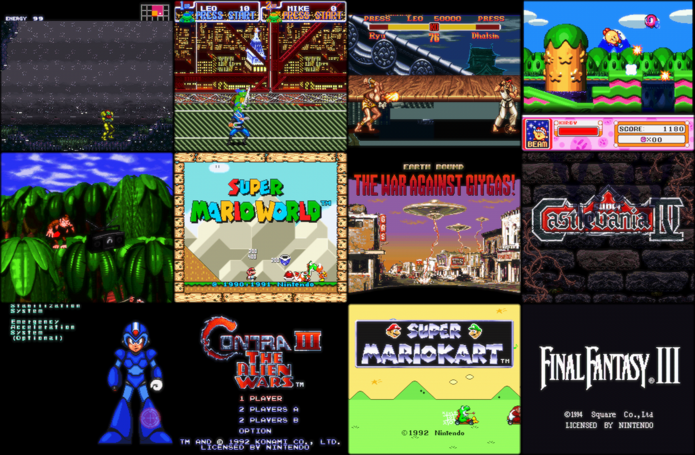

# Yamabuki

A fast, cross-platform SNES emulator written in Zig, built to run full speed
on underpowered ARM handhelds — and, lately, an emulator that writes
patches: it profiles a game, tells you whether a faster CPU would help, and
generates verified FastROM and SA-1 conversions.

- **Speed first**: scanline-based fast core by default, engineered for weak
  ARM chips (Cortex-A53-class and below). Zero heap allocation per frame,
  zero function pointers on hot paths — Zig `comptime` specialization
  generates monomorphized interpreters and renderers.
- **Hybrid accuracy**: an opt-in accurate core (dot-level PPU, per-access
  timing) is built from the same source via `comptime`, selectable at runtime
  per game.
- **Portable**: pure-Zig core with no external dependencies; cross-compiles
  to x86_64 and aarch64 (glibc and musl) with `zig build` alone.
- **Deployable**: a libretro core for RetroArch-based handheld firmware, an
  SDL3 desktop app that plays standalone (overlay menu, gamepads with
  remapping, battery saves, save-state slots, rewind, CRT shaders, a scanned
  ROM library, input-movie recording), and a headless runner for CI and
  analysis.

Contents: [Status](#status) · [Building](#building) · [Playing](#playing) ·
[Shaders](#shaders) · [Patches and SA-1 conversion](#patches-and-sa-1-conversion) ·
[Repository layout](#repository-layout) · [Testing](#testing) ·
[Documentation](#documentation) · [Contributing](#contributing)

## Status

Early development, but a complete machine: the console boots ROMs, renders
every BG mode (2/4/8bpp planar, affine Mode 7 + EXTBG, hi-res modes 5/6,
pseudo-hires) with sprites, windows and colour math, and plays sound through
a full SPC700 + S-DSP (8 BRR voices, gaussian interpolation, ADSR/GAIN,
noise, pitch modulation, echo) with signed, phase-exact mixing. Five
enhancement chips are emulated: Super FX (low level, locked against all 58
krom GSU goldens), SA-1, DSP-1, Cx4 and S-DD1. The 65816 holds full cycle
parity against 5.12 M SingleStepTests cases; 102 homebrew ROMs are locked
against golden framebuffer and audio hashes on both cores and through the
libretro entry points. NTSC and PAL, region auto-detected.

Of the twenty canonical commercial games first surveyed, sixteen play; the
survey and what it found are in
[`docs/COMPATIBILITY.md`](docs/COMPATIBILITY.md). The CRT shader pipeline is
compile-verified for three GL profiles and runs on desktop GPUs; it has not
yet been run on a handheld's GPU.

| Milestone | Status |
|---|---|
| M0-M9 skeleton, cart/bus, 65816, scheduler + DMA, full fast PPU, APU, save states + libretro, SDL3 frontend, accurate core, five enhancement chips | done |
| M10 ARM performance tuning | in progress: tile-row decode cache (+18-39% on 8bpp ROMs), SA-1 ROM-read fast path, deterministic VRAM-traffic perf gate, static-musl handheld packaging with a CI linkage assertion |
| M11 CRT shaders | in progress: GL ES 3 / GL 3.3 / GL ES 2 chain with software fallback, 12 libretro presets baked ahead of time (see [Shaders](#shaders)); not yet run on a handheld GPU |
| M12 ROM patch layer + SA-1 candidacy analyser + patch generation | in progress: soft-patching, the patch registry, the `--sa1-report` analyser, the FastROM generator (CI-gated), and the SA-1 conversion generator through its mainline split — see [Patches and SA-1 conversion](#patches-and-sa-1-conversion) |
| M13 commercial-boot golden gate | done: opt-in, your own ROMs, hash-keyed (`test-commercial`) |
| M14 end-user UI | in progress: the SDL app is a standalone player; deferred: `.zip` ROMs, box art, handheld-class rewind |

The full milestone table with every deliverable and its verification is in
[`docs/ROADMAP.md`](docs/ROADMAP.md).

## Building

Requires Zig 0.16.0 (pinned in `.zigversion` and `build.zig.zon`;
`tools/install_zig.sh` installs it from PyPI if ziglang.org is unreachable).
There are no other build-time dependencies: SDL3 is loaded at runtime, and
the shader tools run on the build host only.

```sh
zig build                        # headless runner + libretro core + SDL3 desktop app, in zig-out/bin
zig build test                   # unit tests (needs nothing else)
tools/fetch_test_data.sh         # CPU test vectors + test ROMs, into test-data/ (gitignored, ~3 GB)
zig build test-roms              # 102 homebrew ROMs against golden hashes (add -Drom-accurate for the accurate core)
zig build test-sst               # 65816 SingleStepTests   (zig build test-sst-spc700 for the SPC700)
zig build test-libretro          # the libretro core against the same goldens
zig build test-patchgen          # FastROM patch generator end to end
zig build fuzz                   # deterministic fuzz + save/load round trip
zig build bench-check            # deterministic perf gate; zig build bench -- <rom.sfc> for FPS
zig build test-commercial -Dcommercial-roms=<dir>  # boot YOUR OWN commercial ROMs against pinned hashes
zig build -Doptimize=ReleaseFast -Dtarget=aarch64-linux-musl  # handheld build
tools/package_handheld.sh        # static musl handheld package (asserts no dynamic deps)
```

Every gate, what it proves, and where its data comes from:
[`docs/TESTING.md`](docs/TESTING.md). Cloning the repository pulls about
70 MB of committed recordings under `tests/surfaces/`; they are the
verification corpus of the SA-1 conversion work and are treated as code.

Run a ROM headless and dump a frame and its audio:

```sh
./zig-out/bin/yamabuki-headless <rom.sfc> --frames 60 --ppm out.ppm --wav out.wav
```

## Playing

```sh
./zig-out/bin/yamabuki-sdl <rom.sfc> [--scale N] [--shader crt-lottes]
./zig-out/bin/yamabuki-sdl           # no argument: open the ROM library
```

The desktop app needs the SDL3 runtime library (`libSDL3.so.0`, `SDL3.dll`)
next to the binary or on the loader path; the build never links it. It is a
complete player: `Esc` (or a pad's guide button) opens an overlay menu over
the paused game — settings, input remapping for two players (keyboard and
gamepads, hotplugged), state slots, per-game overrides, quit. Battery saves
persist as `.srm` files, `F12` takes a PNG screenshot, holding `Backspace`
rewinds, `F10` records an input movie, `F11` opens the takes screen, and
launching with no ROM opens a library scanned from the directories in
`config.zon`'s `library.rom_dirs` (added from the library screen's own
"+ ADD ROM FOLDER" row, or by hand). Everything lives in the OS's per-user
data directory (`%APPDATA%\yamabuki\yamabuki` on Windows,
`~/.local/share/yamabuki/yamabuki` on Linux), and every binding and setting
is editable both in-menu and in `config.zon`.

Keyboard defaults follow RetroArch — arrows = d-pad, `Z`=B, `X`=A, `A`=Y,
`S`=X, `Q`=L, `W`=R, `Enter`=Start, `RShift`=Select — plus `F5`/`F9`
save/load state, `F6`/`F7` state slot, `F1` reset, `P` pause, hold `Tab`
(or the right trigger) to fast-forward, `,` / `.` to cycle shaders, `F8` to
toggle cheats. Gamepads use the positional map every controller era agrees
on: south=B, east=A, west=Y, north=X. Every flag of both binaries and every
hotkey: [`docs/CLI.md`](docs/CLI.md).

## Shaders

`--shader <name>` runs the frame through a libretro CRT shader chain, and
`,` / `.` cycle through the rest without restarting. The shipped set is in
[`shaders/presets.conf`](shaders/presets.conf): the cheap single-pass ones
(`zfast-crt`, `crt-pi`, `crt-lottes-fast`, `crt-easymode`, `sharp-bilinear`)
and the heavyweights (`crt-royale`, `crt-guest-advanced`, `crt-lottes`,
`crt-easymode-halation`, `gtu-v050`, `crt-geom`, `crt-hyllian`), each tagged
`handheld` or `desktop`.

The presets are libretro *slang* shaders, and the emulator contains no
shader compiler: they are transpiled once on the build host by glslang and
SPIRV-Cross (themselves built with `zig c++`) into plain GLSL for three
profiles, GL ES 3, GL 3.3 and GL ES 2, plus a manifest of reflected uniform
offsets. A preset that cannot work on a profile is absent from it, not
broken; if no profile works the frontend prints why and falls back to the
software blit.

```sh
tools/fetch_shaders.sh           # libretro slang-shaders (pinned, gitignored)
tools/build_shader_tools.sh      # glslang + SPIRV-Cross, built with zig as the C++ compiler
zig build shaders                # transpile the presets in shaders/presets.conf to GLSL
zig build validate-shaders       # parse every baked manifest and stat the files it references
```

Why it is done this way, and what it buys: [`docs/SHADERS.md`](docs/SHADERS.md).

## Patches and SA-1 conversion



The emulator applies patches, finds them, and writes them.

- **Soft-patching.** `--patch` applies a BPS or IPS at load (BPS
  hash-verified both ways); `--auto-patch` finds the right patch for your
  cart through a hash-keyed registry (`patches/registry.zon` — an index,
  never a payload); `--save-patched` writes the result. The SDL player
  discovers patches on its own and asks PLAY PATCHED / PLAY ORIGINAL,
  remembered per game with separate saves per identity.
- **Is this game CPU-bound?** `yamabuki-headless <rom> --sa1-report`
  profiles a game and tells you whether an SA-1 conversion would help,
  measuring the time the CPU spends *waiting* rather than the time it
  spends working, and counting slowdown apart from load stalls. Run across
  a library of seventy-six carts it independently ranked the two games
  Vitor Vilela actually converted among the most CPU-starved. How it
  works, and every plausible rule that turned out wrong:
  [`docs/CPU_BOUND_ANALYSER.md`](docs/CPU_BOUND_ANALYSER.md).
- **FastROM generation.** `--gen-fastrom-patch` derives a FastROM
  conversion mechanically, verifies it in-emulator (every frame pixel- and
  audio-identical to the unpatched run, MEMSEL held), and only then emits
  a BPS. CI runs the whole loop (`zig build test-patchgen`).
- **SA-1 generation.** `--gen-sa1-patch` converts a cart to an SA-1 board
  and, in its `--window` form, relocates the game's low WRAM into BW-RAM and
  splits the per-frame logic onto the SA-1 while the S-CPU keeps the
  hardware-facing work. Every conversion is verified against recorded
  playthroughs before a patch is written: strict pixel-and-audio identity
  when timing did not change, behavioural equivalence (the game's logic
  state at every tick) when it did, and a refusal by name otherwise. The
  Super Metroid conversion has shipped through 78 verified versions; its
  patches, exact command lines and recorded verification takes live in
  [`tests/surfaces/sm-sa1/`](tests/surfaces/sm-sa1/README.md).

The methodology is in
[`docs/SA1_CONVERSION_LEARNINGS.md`](docs/SA1_CONVERSION_LEARNINGS.md), the
Super Metroid campaign in [`docs/SM_SA1_FINDINGS.md`](docs/SM_SA1_FINDINGS.md),
and the flags in [`docs/CLI.md`](docs/CLI.md).

## Repository layout

```
src/core/        the emulator: cpu/ memory/ ppu/ apu/ cart/ chips/, console.zig, serialize.zig, profile.zig
src/frontends/   headless/ (CLI + analysis + generators), sdl/ (desktop player), libretro/, movie.zig
tests/           the runners behind zig build test-*, golden hashes, the SA-1 verification surfaces
bench/           headless FPS benchmark and the deterministic perf baseline
tools/           host-side scripts: fetch test data, bake shaders, package handhelds (tools/README.md)
patches/         the patch registry index and the auto-FastROM compatibility list
shaders/         presets.conf (what ships) and the baked GLSL (gitignored)
docs/            documentation; docs/README.md is the index
```

The module map, the core's design and the decisions behind it:
[`docs/ARCHITECTURE.md`](docs/ARCHITECTURE.md).

## Testing

Correctness is externally anchored and nothing is vendored: the 65816 and
SPC700 are held to the SingleStepTests vectors, 102 homebrew ROMs to golden
hashes on both cores and through libretro, commercial games to boot hashes
of dumps you supply, and performance to deterministic instruction, cycle
and VRAM-traffic counts rather than wall-clock time. A deterministic fuzz
harness covers the renderer, the bus and the save/load round trip. CI runs
all of it on Linux plus a native Windows unit-test job, a five-target
cross-compile matrix with a static-linkage assertion, an SDL smoke test,
and the shader bake. Details, the build options, and how to mint a golden:
[`docs/TESTING.md`](docs/TESTING.md).

## Documentation

[`docs/README.md`](docs/README.md) is the index. In short:
[architecture](docs/ARCHITECTURE.md) · [testing](docs/TESTING.md) ·
[command line](docs/CLI.md) · [shaders](docs/SHADERS.md) ·
[compatibility](docs/COMPATIBILITY.md) ·
[the CPU-bound analyser](docs/CPU_BOUND_ANALYSER.md) ·
[surround audio](docs/AUDIO_SURROUND.md) · [roadmap](docs/ROADMAP.md) ·
[SA-1 conversion learnings](docs/SA1_CONVERSION_LEARNINGS.md) ·
[Super Metroid findings](docs/SM_SA1_FINDINGS.md) ·
[the September 2026 audit](docs/AUDIT_2026-09.md).

## Contributing

- `zig fmt --check .` is the first CI job; `zig build test` must pass with
  nothing fetched. The other gates need `tools/fetch_test_data.sh` once.
- Emulation changes that alter a golden hash re-mint the golden in the same
  commit and say why the picture changed. Performance changes re-baseline
  `bench/baseline.zon` only after the goldens are shown unchanged.
- The core stays pure Zig with no allocation after construction; frontends
  hand-port the ABIs they need rather than adding a build-time dependency.
- Test data and ROMs are never committed. Patches are indexed, never
  vendored. The recordings under `tests/surfaces/` are the exception, and
  deleting one is a code change.
- The repository has no LICENSE file yet; until it does, the project's own
  licence is unstated (the fetched test data and shaders belong to their
  upstreams).
